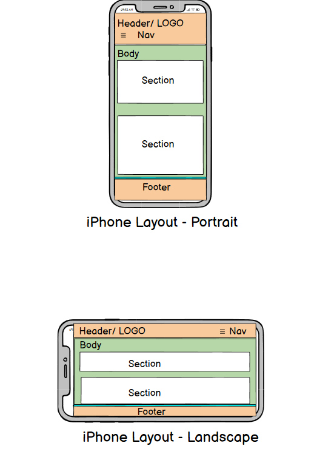
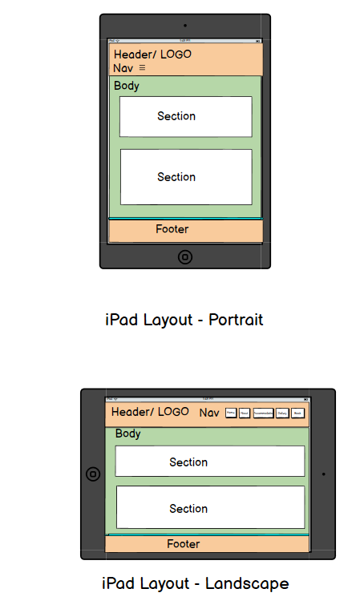
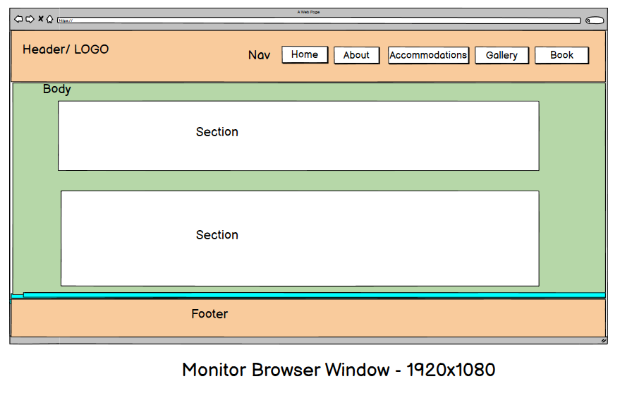
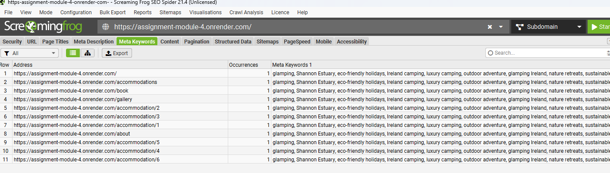
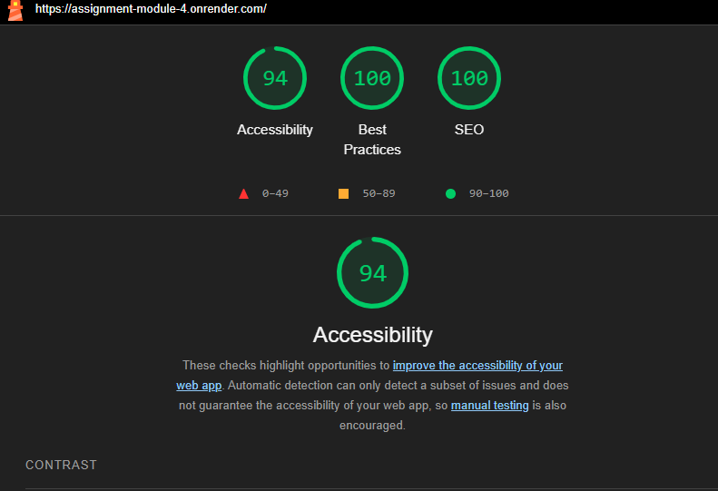
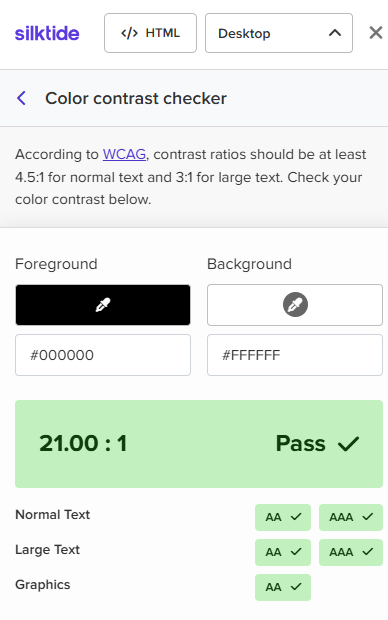

# assignment-module-4

## Submission readme.md file
Github-repo: URL:
    https://github.com/aruttle/assignment-module-4

Render: URL:
    https://assignment-module-4.onrender.com/ 
    https://dashboard.render.com/web/srv-d11d41mmcj7s73a46hog

Render: Assignment Admin page:
    https://assignment-module-4.onrender.com/admin/bookings

Login Name: 
    'admin'

Login Password:
    '0000'

### Site Map

### Site Map Address 
    https://assignment-module-4.onrender.com/
    https://assignment-module-4.onrender.com/accommodations
    https://assignment-module-4.onrender.com/book
    https://assignment-module-4.onrender.com/gallery
    https://assignment-module-4.onrender.com/about
    https://assignment-module-4.onrender.com/admin/login
    https://assignment-module-4.onrender.com/admin/bookings

## Wireframes
Click [here](./docs/wireframes.pdf)

[Link to view the image](./docs/iphone-wireframe.png)

[Link to view the image](./docs/ipad-wireframe.png)

[Link to view the image](./docs/monitor-wireframe.png)    

## Planning Analysis Sheet
### Website goal
    The goal of this website is to deliver a user-friendly, accessible, and visually appealing platform for a family-run glamping business near the Shannon Estuary. It enables visitors to easily browse accommodations, view a curated gallery, and make bookings through a secure, responsive interface. Built with Flask and PostgreSQL, the site emphasises clean code structure, data integrity, and modern web design principles. It aims to meet the assignment requirements by incorporating features such as admin login, dynamic booking management, and SEO-friendly pages, all optimised to be responsive across devices.

## Features

**Interactive Booking System** – Visitors can browse available accommodations and make bookings directly through the website.

**Responsive Design** – Built with Bootstrap to ensure seamless viewing and interaction across mobiles, tablets, and desktop devices.

**Dynamic Content** – Pages such as Gallery and About are easily maintainable and render content dynamically.

**User-Friendly Navigation** – Consistent and intuitive layout for effortless browsing.

**Flask Backend** – A lightweight and efficient Python framework used for routing and managing form submissions.

**Templating System** – Utilises reusable HTML components and template inheritance to reduce repetition.

**PostgreSQL Database** – Stores accommodation, guest, and booking data securely and reliably.

## How to Use

### **Accommodation Browser**
Browse a selection of glamping accommodations.

Each listing includes a name, description, and image.

Click the "Book Now" button to start the booking process for your chosen accommodation.

### **Booking System**
Complete a straightforward form with your name, contact details, and preferred check-in and check-out dates.

The system validates dates to prevent overlapping bookings.

Upon submission, a booking confirmation is displayed with all your details.

Your booking is saved securely in the database for reference.

### **Gallery**
View images showcasing the glamping site and surrounding natural beauty.

Ideal for getting a sense of the experience before booking.

### **About Page**
Discover the story behind the family-run glamping site, its location by the Shannon Estuary, and its eco-friendly ethos.

### **Contact Page**
Reach out easily via a contact form for enquiries or special requests.

Simple form includes fields for name, email, and message.

# Working Page Titles and Goals

## Home
**Goal:** Welcome visitors and highlight the unique charm of glamping near the Shannon Estuary. Provide an overview of offerings and encourage exploration of accommodations.

## Booking
**Goal:** Allow users to select dates and accommodation with a streamlined form featuring real-time validation and clear feedback. 

## Gallery
**Goal:** Visually present the glamping experience, emphasising natural beauty and unique site features.

## About
**Goal:** Introduce the family-run business, its values, and the advantages of the location. Build trust and connection with visitors.

## Contact
**Goal:** Provide a straightforward way for visitors to send enquiries, requests, or feedback.

## Database Tables Overview

The application utilises a PostgreSQL database structured with several key tables to manage the glamping site’s data efficiently:

### **Guest Table**  
Stores information about guests who make bookings. Key fields include:  
- `id` (Primary Key)  
- `name`  
- `email` (used to identify returning guests)  
- `phone`  

### **AccommodationType Table**  
Defines different types or categories of accommodations (e.g., tents, cabins, pods). Fields include:  
- `id` (Primary Key)  
- `name` (e.g., "Luxury Tent", "Wooden Cabin")  
- `description`  

### **Accommodation Table**  
Lists individual accommodations available on the site. Each accommodation is linked to an accommodation type. Important fields include:  
- `id` (Primary Key)  
- `name`  
- `type_id` (Foreign Key referencing AccommodationType)  
- `description`  
- `image_url` (path to the accommodation image)  

### **Booking Table**  
Records all bookings made by guests. Each booking associates a guest with an accommodation and includes booking dates. Fields include:  
- `id` (Primary Key)  
- `guest_id` (Foreign Key referencing Guest)  
- `accommodation_id` (Foreign Key referencing Accommodation)  
- `start_date`  
- `end_date`  

---

This structure allows the site to efficiently manage guest details, accommodation options, and booking schedules while maintaining data integrity through proper relational links.

## List of sources
### Images
   Images:
   https://app.klingai.com/
   https://pixabay.com/illustrations/search/cleat%20hitch/

   All other images are my own

### Other Websites
    MDN:
    https://developer.mozilla.org/en-US/docs/Web
    Swiper:
    https://swiperjs.com/
    Google Maps:
    https://www.google.com/maps

### Logo
    The logo was created in PowerPoint from Icons.

### Video
    Youtube: https://www.youtube.com/watch?v=jPzHaW4Q32U

## SEO Features
    I used meta-keywords and sitemap.xml

[Link to view the image](./docs/meta-keywords.png)

## Accessibility
   To check the accessability of the site I used a combination of Lighthouse and  Silktide. All scored high

[Link to view the image](./docs/lighthouse.png)

[Link to view the image](./docs/silktide.png)

## Future Enhancements

With more time, I would have liked to implement the following features to improve functionality, user experience, and overall site robustness:

- **User Accounts & Authentication:**  
  Allow users to create accounts, log in, and manage their bookings directly.

- **Email Notifications:**  
  Automatically send booking confirmations, reminders, and updates via email.

- **Improved Booking Management:**  
  Enable guests to modify or cancel bookings through their accounts.

- **Admin Dashboard Enhancements:**  
  Include detailed analytics, booking statistics, and accommodation management tools.

- **User Reviews and Ratings:**  
  Allow guests to leave reviews and ratings for accommodations.

## Challenges

### During development, I encountered several coding challenges. By leveraging resources such as MDN Web Docs, college notes, and AI-assisted queries, I was able to solve most issues. Some examples include:
 I initially attempted to use Flask-Migrate and render.yaml for automated database migrations on Render.com. However, this approach did not work as expected due to configuration issues. As a workaround (after many hours of pulling my hair out), I manually created the PostgreSQL database instance via Render’s dashboard and connected the app directly to this new server. 
 One frustrating issue I only discovered late in the assignment was that I had accidentally created two branches on GitHub: main and master. All my commits had been pushed to the master branch, while main was intended as the primary branch. Once I noticed this, I consolidated all the commits into the main branch to keep the repository organised. The dates were effected by the consolidation in main but I kept both branches. See image below with correct dates for commits on the master branch: 

[Link to view the image](./docs/repo-before-change-from-master-to-main.png)